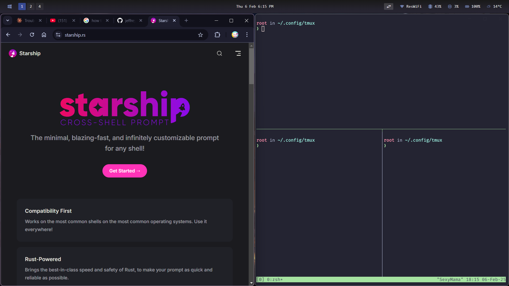

# Contributors
Victor Perez Contreras

# Usage
```bash
#Installation:
./main.sh
```
Note:
    After Installing packages reload the terminal and or VM/PC. 
    This allows the terminal to properly source the fonts.

# Setup: Windows



# Components and Reasoning
## Neovim Config
Based off of: https://github.com/cpow/neovim-for-newbs

## Starship
    - Fast and light way terminal. 
    - Very sleek as well.

## ZSH
Allows for autocompletion and history, greatly increasing workflow.

## WezTerm
Easy to use on windows and customizable. Helps remove key binding conflicts from the base Windows terminal emulator.

# TODO 
    - Add question to ask whether the OS is Windows or Linux
    - Add tiling functionality depending on OS
    - Look into cosmic for Linux tiling

# Windows Specific
Tiling manager glaze: https://github.com/glzr-io/glazewm
Config file stored manually. Copy file to setup folder.

# Inspiration
Based off of: https://github.com/cpow/neovim-for-newbs

Cpow created a short series giving a tutorial on how to install Neovim.
I adapted this setup to properly install the rest of my Linux setup.
